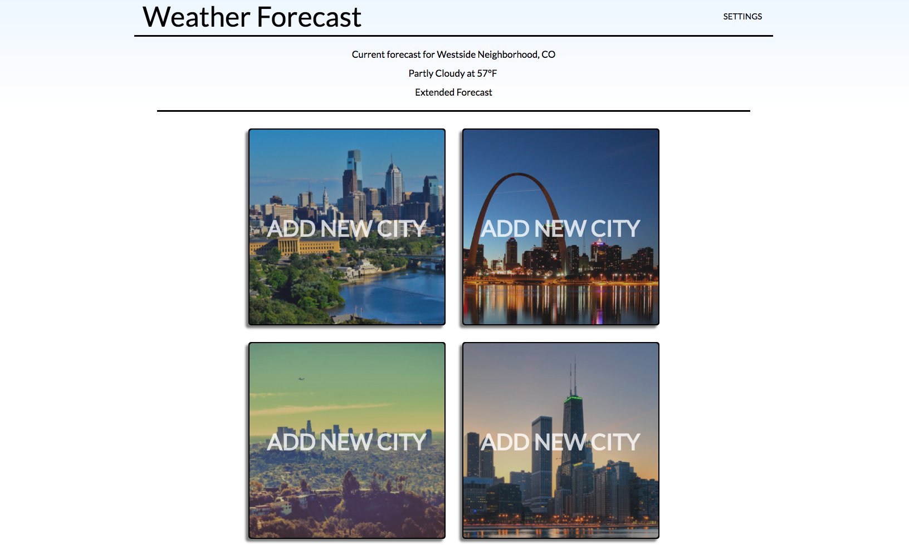

## Weather Forecast

Application that allows users to immediately see their current weather forecast and the ability to add up to four other weather locations.

The project was built with [React](https://facebook.github.io/react/), [Redux](http://redux.js.org/), [webpack](https://webpack.github.io/), [React Router](https://github.com/ReactTraining/react-router), and CSS.

Weather information was acquired using [The Wunderground API](https://www.wunderground.com/weather/api/).

## Project Screen Shot

## Installation and Setup Instructions

Clone down the repo. You will need `node` and `npm` installed globally on your machine.  

Installation:

`npm install`   

To Start Server:

`npm start`  

## Reflection

This is a group project that was built during Module 3 at Turing School of Software and Design.

The purpose of the application was to continue building our knowledge of APIs while also providing a foundational knowledge of React Router. A limitation to the project was to only allow the user to add four additional locations in addition to the user's current location (determined by using `navigator.geolocation`).

Future enhancements to the application include a more robust use of the Wunderground API that might create a better UX for the user.
